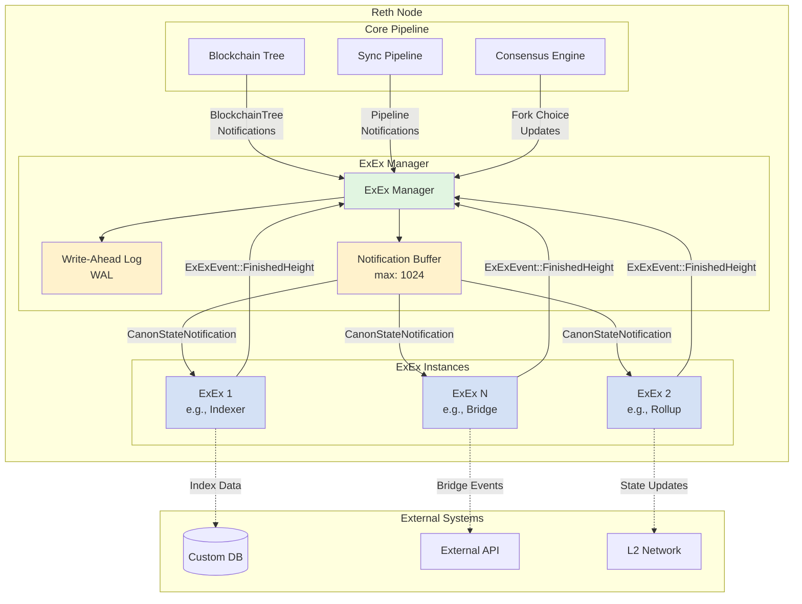
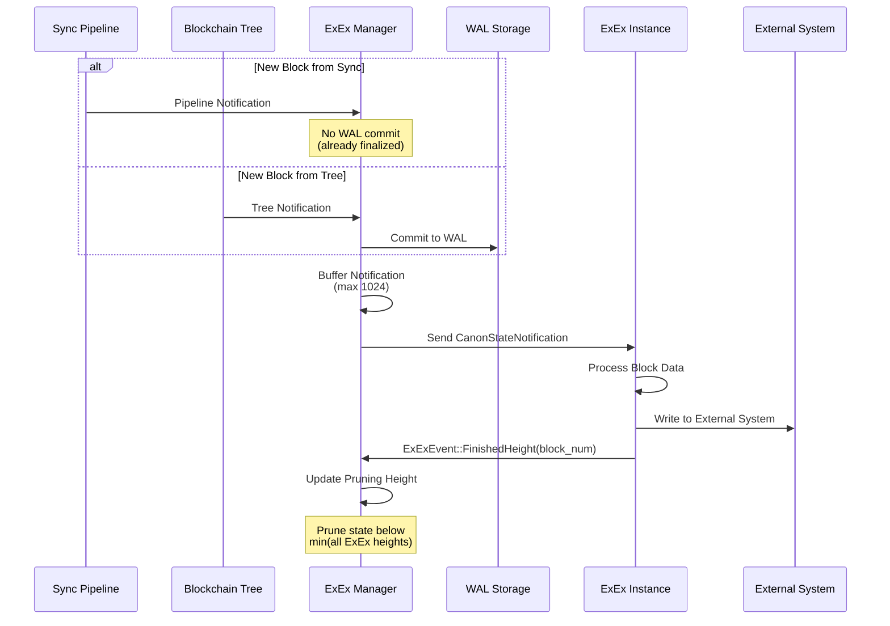
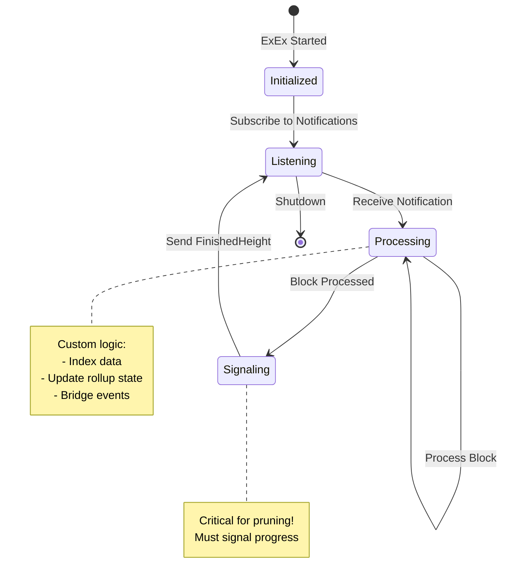

# Reth Execution Extensions (ExEx)

## Architecture Overview

ExEx (Execution Extensions) enables custom functionality to be added to the Reth pipeline. It allows developers to build custom indexers, rollups, bridges, and other state derivations that run alongside the main node.

## Architecture Diagram



## Data Flow



## Key Components

### 1. **ExEx Manager**

- Coordinates all ExEx instances
- Manages notification distribution
- Handles state pruning based on ExEx progress
- Maintains WAL for crash recovery

### 2. **Notification System**

- **CanonStateNotification**: Main notification type for state changes
- **Buffer**: Up to 1024 notifications (3.5 hours of mainnet blocks)
- **Source Types**:
  - Pipeline: Already finalized blocks
  - BlockchainTree: New blocks requiring WAL persistence

### 3. **WAL (Write-Ahead Log)**

- Ensures ExEx consistency during crashes
- Only stores BlockchainTree notifications
- Warning threshold: 128 blocks

### 4. **ExEx Context**

- Provides access to node components
- Notification stream for state updates
- Event channel for signaling progress

## State Management



## Example ExEx Implementation

```rust
async fn my_exex<N: FullNodeComponents>(
    mut ctx: ExExContext<N>,
) -> Result<(), Box<dyn std::error::Error>> {
    // Subscribe to notifications
    while let Some(Ok(notification)) = ctx.notifications.next().await {
        if let Some(committed) = notification.committed_chain() {
            for block in committed.blocks_iter() {
                // Custom processing logic
                process_block(block)?;
            }
            
            // Signal completion for pruning
            ctx.send_finished_height(committed.tip().num_hash());
        }
    }
    Ok(())
}
```

## Use Cases

| Use Case | Description | Example |
|----------|-------------|---------|
| **Indexers** | Index blockchain data for queries | Token transfers, NFT metadata |
| **Rollups** | Build L2 state from L1 data | Optimistic/ZK rollups |
| **Bridges** | Track cross-chain events | Token bridges, message passing |
| **Analytics** | Real-time blockchain analytics | MEV detection, gas analysis |
| **Oracles** | Provide off-chain data | Price feeds, event attestation |

## Best Practices

1. **Always emit FinishedHeight** - Critical for proper state pruning
2. **Handle errors gracefully** - ExEx should not crash the node
3. **Minimize blocking operations** - Use async operations
4. **Control resource usage** - Monitor memory and CPU
5. **Process notifications in order** - Maintain canonical consistency
