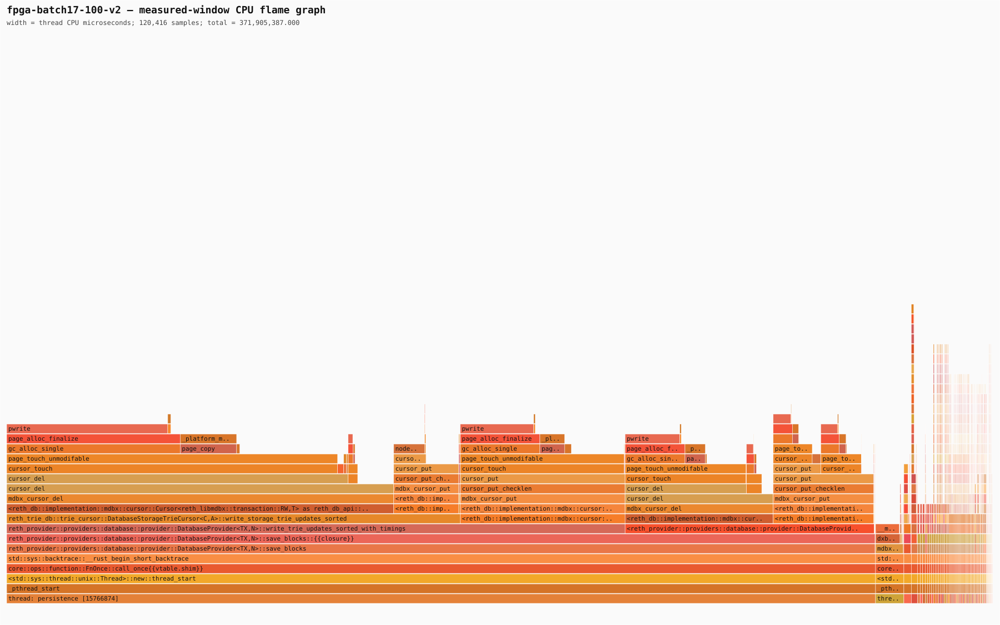
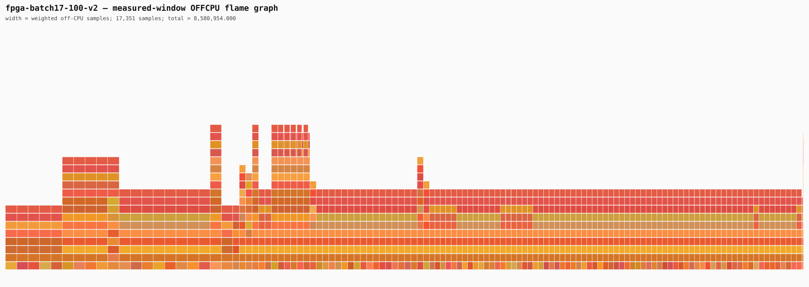

# COW-focused transaction batching benchmark

## Outcome

The supported software candidate is a larger Reth persistence transaction: set
`--engine.persistence-threshold 32`, which produced 33-block `save_blocks` batches with the
memory-block-buffer target fixed at zero. This does not bypass MDBX durability. It merges more
cross-block trie mutations before one MDBX write transaction, so the same leaf is copied and
repacked fewer times.

On the frozen 20-block warm-up plus deterministic 100-block discovery slice, batch 33 beat an
unprofiled batch-17 control using the same instrumented Reth binary and retained `reth-bench`
binary:

| Metric | Batch 17 | Batch 33 | Change |
|---|---:|---:|---:|
| Measurement injection | 549.006 s | 434.895 s | -20.78% |
| Excluded durability drain | 89.313 s | 131.323 s | +47.04% |
| Injection plus drain | 638.319 s | 566.219 s | -11.30% |
| Process CPU | 374.72 CPU-s | 343.97 CPU-s | -8.21% |
| Maximum RSS | 16.924 GB | 16.902 GB | -0.13% |
| Persisted blocks inside metric boundary | 119 | 132 | +10.92% |
| COW pages | 767,034 | 682,307 | -11.05% |
| COW pages / persisted block | 6,445.7 | 5,169.0 | -19.81% |
| Dirty-page equivalents / persisted block | 12,904.6 | 7,697.2 | -40.35% |
| New pages | 2,999 | 2,189 | -27.01% |
| Page splits | 574 | 630 | +9.76% |
| MDBX sync total | 14.474 s | 8.044 s | -44.42% |
| MDBX sync average | 1.034 s | 1.005 s | -2.74% |
| `save_blocks` MDBX time | 604.112 s | 537.384 s | -11.05% |
| Hashed-state write | 164.461 s | 169.856 s | +3.28% |
| Account-trie write | 122.893 s | 112.836 s | -8.18% |
| Storage-trie write | 315.663 s | 253.502 s | -19.69% |

The phase split is causal evidence for COW reduction rather than faster hashing. Hashed-state time
was effectively unchanged, while storage-trie mutation, dirty pages, sync work, CPU, and wall time
fell together. The remaining increase in page splits is a cost of constructing larger trees in one
transaction and should be watched in longer trials.

Both discovery runs passed stopped-node cold reopen and matched the expected canonical block hash
and state root at block `25661283`. They used source commit
`eb4c15e5e36d8776d46629beae4c0a69af7ab04f`, Reth binary SHA-256
`962359985d444d022c75e77376d8428158cf2f5c8dcd1119741201303fdd8894`, and retained
`reth-bench` SHA-256
`43fbab6fc50e1b04dca83ddaa5723569788b6822fff3c551a9c6f3b4c5f90768`. Samply was disabled in
both controls, so the wall comparison does not contain profiler asymmetry.

## Full 500-block confirmation

The same batch-33 candidate injected the complete frozen 500-block workload in approximately
1,978.964 seconds, or 0.2527 block/s. The time is the nanosecond mtime delta between the two
Prometheus boundary files; on the two completed 100-block runs this method differed from the
runner's monotonic clock by 36 ms and 3 ms respectively.

The threshold-32 measurement boundary contained 15 completed 33-block saves. One pending warm-up
block was included in the first batch, so 494 measured blocks were durable at injection end and six
measured blocks remained pending.

| Full-workload metric | Batch 33 result |
|---|---:|
| Measured blocks injected | 500 |
| Save batches completed at injection boundary | 15 |
| Blocks persisted in boundary, including one pending warm-up block | 495 |
| COW pages | 2,488,091 |
| COW pages / persisted block | 5,026.4 |
| Dirty-page equivalents / persisted block | 7,888.7 |
| New pages | 9,743 |
| Page splits | 2,156 |
| Prefault write operations | 2,176,202 |
| RW commits | 30 |
| Commit sync total / average | 39.776 s / 1.326 s |
| `save_blocks` MDBX time | 1,860.905 s |
| Hashed-state write | 599.966 s |
| Account-trie write | 387.618 s |
| Storage-trie write | 869.275 s |

COW remained at 5,026 pages per persisted block, 2.76% below the 100-block batch-33 value. The
software gain therefore did not disappear as the database accumulated changes. Approximately
20.6 MiB of COW page images per persisted block still remain at a 4 KiB page size, so batching
reduces but does not remove the final-page construction/write problem.

### Frozen-corpus tail handling

The original full-workload runner could not perform its native threshold-32 drain. The immutable
corpus ends exactly at measured block `25661683`, while filling the final 33-block transaction
would require 27 future blocks beginning at `25661684`. No new blocks or snapshot were downloaded.

The measurement boundary was preserved. After the original process stopped, the database was at
`25661677`; the recovery script replayed only the six pending measured blocks with a temporary
threshold of five (batch six), stopped the node, and reopened it with the original threshold of 32.
The reopened head was `25661683`; its hash
`0x518362ab3b90c9bd68c79782b007992ca503a20f0aedfc5849e2307847c97533` and state root
`0x0fe41c20d9fdfaee74072814d8d554fce56eeafcceb5507eb4f64536e0e6551c` matched the frozen
corpus.

This validates the 500-block execution/persistence result and endpoint correctness, but it does
not provide a native threshold-32 drain-latency number or post-drain threshold-32 counters. The
original runner also exited before serializing process CPU samples, and its orphaned `iostat` was
stopped; those two metrics are intentionally excluded. The exact recovery procedure is implemented
by `research/reth-2.0-fpga/scripts/recover_locked_corpus_tail.py`.

## Direct COW-phase attribution

A separate low-overhead attribution run used the same frozen 20-block warm-up and 100-block slice,
the accepted threshold-32 configuration, and no stack profiler. The measurement-only build retained
the original cursor delete/upsert hot paths rather than the rejected page-batch prototype. Its
source was commit `dd88ea7ac883c5850338bb2884f72202edd3b456` plus recorded diff SHA-256
`21701cb2c5db395ea77f50a78864810717fe063224db45fd19e5cc3bd2aa7b77`; the Reth binary SHA-256
was `54a7aa8aa1576889bc436b569c7478276a161ba5c19cfe6378e853baf733205a`.

The run injected 100 blocks in 435.573 seconds, only 0.16% slower than the 434.895-second batch-33
control. Its excluded durability drain took 126.179 seconds, for 561.752 seconds injection plus
drain. Cold reopen matched the expected hash and state root at block `25661283`.

At the injection boundary, three 33-block saves had completed and two blocks remained in memory.
The phase counters account for 519,764 of 519,803 transaction COW operations (99.9925%):

| Persistence phase | COW operations | COW share | Phase time | Splits |
|---|---:|---:|---:|---:|
| `write-storage-trie` | 242,458 | 46.64% | 191.839 s | 145 |
| `write-hashed-state` | 163,258 | 31.41% | 126.777 s | 252 |
| `write-account-trie` | 113,533 | 21.84% | 92.329 s | 57 |
| `insert-block` | 329 | 0.06% | 0.438 s | 22 |
| `write-state` | 186 | 0.04% | 0.309 s | 1 |
| Unattributed residual | 39 | 0.01% | n/a | n/a |

The cursor timers identify the concrete operations below. Durations are aggregate timers and can
overlap when work is concurrent, so they rank targets but must not be added to obtain wall time.

| Table and operation | Aggregate time | Calls | Logical/result/serialized bytes |
|---|---:|---:|---:|
| `StoragesTrie cursor-delete-current` | 168.342 s | 157,788 | 66.607 MB deleted |
| `AccountsTrie cursor-upsert` | 92.242 s | 112,743 | 50.902 / 0 / 47.181 MB |
| `HashedStorages cursor-delete-current` | 69.538 s | 45,277 | 1.914 MB deleted |
| `StoragesTrie cursor-seek-by-key-subkey` | 50.124 s | 1,114,740 | 72.458 / 455.867 / 0 MB |
| `HashedStorages cursor-seek-by-key-subkey` | 40.142 s | 552,158 | 35.338 / 24.784 / 0 MB |
| `HashedStorages cursor-upsert` | 29.265 s | 45,504 | 3.415 / 0 / 1.959 MB |
| `AccountsTrie cursor-seek` | 28.323 s | 630,486 | 20.806 / 284.882 / 0 MB |
| `HashedAccounts cursor-upsert` | 27.681 s | 26,284 | 1.308 / 0 / 0.467 MB |
| `StoragesTrie cursor-upsert` | 22.711 s | 157,801 | 71.651 / 0 / 66.601 MB |

Node serialization across every nonzero instrumented operation was only 0.110 seconds, and trie
batch merging was 0.025 seconds. Neither is a supported primary target. The block/static-data path
was also negligible: for example, all 99 `HeaderNumbers put-upsert` calls took 0.335 seconds.

### I/O work to remove

The same injection boundary recorded 694,564 dirty-page equivalents (2.845 GB), 519,803 COW page
operations, 483 splits, and 455,806 MDBX prefault `pwrite`/`pwritev` operations. libMDBX does not
export each vector length, but one 4 KiB database page per prefault operation gives a strict lower
bound of 1.867 GB written by those calls. Device `iostat` is system-wide and is therefore retained
only as supporting evidence, not attributed to Reth bytes.

There were six read-write commits and 7.938 seconds of commit sync during injection. In contrast,
the three `save_blocks` calls consumed 420.876 seconds. The optimization target is therefore the
number of COW page images and prefault writes before commit, not an fsync-only accelerator.

## Flame graphs

The retained Samply batch-17 discovery profile is independent stack evidence for the page counters.
Its CPU leaves were `pwrite` 34.07%, `page_touch_unmodifable` 22.93%, `_platform_memmove` 13.30%,
`cursor_del` 4.80%, and `cursor_put` 4.51% of profiled CPU. The first three account for 70.70%.
The off-CPU graph is dominated by condition-variable waits, led by
`tokio-rt | __psynch_cvwait` at 12.09% of weighted off-CPU samples. The flame graph and direct
phase-attribution runs were intentionally not simultaneous.

## Decision

Batch 33 is accepted as the COW-throughput research candidate. It gives a reproducible reduction in
repeated COW, dirty pages, storage-trie write time, CPU, and wall time without changing canonical
state. It is not yet recommended as an unconditional production default because its excluded drain
was 47% slower than batch 17 and it increases the crash-replay/visibility distance to as many as 33
blocks.

Use batch 17 as the latency-conservative control and batch 33 as the sustained-throughput control in
future trials. The next software step is an adaptive transaction policy bounded by time, dirty
pages, and block count, rather than a fixed block count alone.

After this software reduction, the remaining hardware-relevant path is narrower:

1. add a transaction-local `StoragesTrie` mutation buffer that groups sorted delete/upsert pairs by
   destination leaf and constructs each final leaf once; this directly targets 46.64% of COW and
   the 168.342-second delete-current aggregate;
2. apply the same leaf-local final-page construction to `HashedStorages`/`HashedAccounts`, targeting
   the 31.41% hashed-state COW share and its delete/seek/upsert sequence;
3. group `AccountsTrie` upserts by destination leaf, targeting the remaining 21.84% account-trie
   COW share;
4. coalesce adjacent dirty-page descriptors so MDBX issues fewer prefault writes and bytes while it
   retains MVCC visibility, page allocation, commit ordering, durability, and recovery ownership.

These are software changes first. Re-profile after each step. FPGA offload is justified only if the
reduced path remains dominated by `page_touch_unmodifable`, `memmove`, final-page slot/offset repair,
and `pwrite` descriptor generation; hashing, serialization, merge-batch, static files, and fsync are
not supported FPGA priorities in this corpus.
