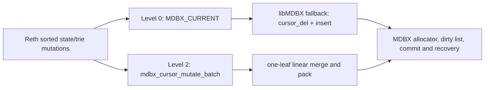

# CPU page-batch reference engine for Reth state persistence

Status: implemented CPU reference prototype, correctness-tested and measured on the frozen Reth
v2 workload. The first custom libMDBX API is intentionally narrow: it batches exact, same-size
replacements for one DUPSORT outer key. The deterministic 100-block discovery run rejected this
version as a performance candidate, so it is a research control rather than a production backend.

## Problem statement

Reth Storage V2 persists sorted mutations into `HashedAccounts`, `HashedStorages`, `AccountsTrie`,
and `StoragesTrie`. Duplicate-sorted storage tables currently replace an existing row with
`seek -> delete_current -> upsert`. Profiling on the frozen workload attributed most persistence
time to the resulting libMDBX page mutation path rather than hashing, trie-update merging, node
serialization, or commit sync.

The reference engine changes the unit of work from an isolated row operation to an ordered page
mutation batch while preserving MDBX transaction ownership and byte-level correctness.



## Levels

### Level 0: fused current-row replacement

This level is implementable through the existing public MDBX API and is the first measured CPU
control. After an exact seek positions a duplicate cursor, an update is issued with `MDBX_CURRENT`
instead of deleting the row and inserting its replacement.

```text
before: seek -> delete_current -> upsert
after:  seek -> update_current(MDBX_CURRENT)
```

Level 0 applies to `HashedStorages` and `StoragesTrie`. Deletes and inserts retain their existing
operations. Non-duplicate `HashedAccounts` and `AccountsTrie` already use a single upsert for
replacement.

This is an API-call fusion control, not a page-batch implementation. In the vendored libMDBX
`cursor_put()` path, `MDBX_CURRENT` falls back to `cursor_del()` followed by insertion when a
duplicate-sorted key has more than one value or the encoded value length changes. Only the
single-duplicate, same-length case can overwrite bytes directly. Consequently the Level 0 run is
expected to leave much of the internal page delete/add, compaction, split, and COW cost intact; it
measures how much can be removed without changing libMDBX itself.

### Level 1: logical batch planner and software oracle

The planner accepts mutations in MDBX key order and produces page-local batches. Last-write-wins
coalescing is performed before page assignment. A batch never crosses transaction, database, table,
page-format, or page-generation boundaries.

```text
PageBatch {
    transaction_id,
    table_id,
    source_page_number,
    source_page_generation,
    ordered_mutations: [Delete | Upsert],
}
```

The software oracle merges decoded source entries with the ordered mutation stream, packs the
result into one or more destination pages, and returns split separators and retired-page metadata.
It is deterministic and is the correctness oracle for a future FPGA backend.

### Level 2: libMDBX batch integration

True one-touch page batching cannot be implemented above the current cursor API. The reference
implementation was therefore made in an exact libMDBX v0.13.7 source clone at upstream commit
`566b0f93c7c9a3bdffb8fb3dc0ce8ca42641bd72`, regenerated as an amalgamation, and vendored into
Reth v2. Keeping the C implementation in this branch is deliberate: the experiment needs to change
MDBX page behavior, not merely reduce Rust-to-C call overhead.

The proposed C boundary is conceptually:

```c
int mdbx_cursor_mutate_batch(
    MDBX_cursor *cursor,
    const MDBX_val *outer_key,
    const MDBX_batch_mutation *mutations,
    size_t mutation_count,
    MDBX_batch_result *result);
```

The implementation must remain inside the active write transaction and reuse libMDBX's page
allocation, free-list, dirty-page, split/merge, root publication, commit, and recovery machinery.

### Level 2 CPU reference implementation plan

The implementation is pinned to the exact vendored libMDBX revision. It is not a C loop over
`mdbx_cursor_del()` and `mdbx_cursor_put()`. It resolves all replacements first, rejects the whole
batch before mutation when unsupported, touches each affected inner leaf path once, overwrites the
validated slots in the dirty image, and publishes the nested-tree descriptor through the existing
MDBX transaction.

The first implemented path targets ordered, fixed-size replacements in one or more DUPSORT inner
leaves for a single outer key, which covers part of `HashedStorages` and `StoragesTrie`:

1. Validate the write transaction, DUPSORT table, outer key, exact old values, fixed encoded sizes,
   mutation order, leaf layout, and boundary-key safety. Unsupported batches return
   `MDBX_RESULT_TRUE` without applying a partial change.
2. Resolve mutations to inner leaf page/slot pairs and validate the complete resulting sort order.
3. Touch the outer path once, then touch each affected inner leaf path once and overwrite every
   validated slot in that dirty image.
4. Publish the changed nested-tree root after every leaf group. This is required because a later
   `MDBX_GET_BOTH` reloads the descriptor from the outer node. Deferring publication loses an
   earlier clean-page COW root; the clean-page regression test exists specifically for this case.
5. Leave allocator, dirty-list, spill, commit, sync, and recovery ownership in MDBX.

Deletes, inserts, variable-size replacements, inline subpages, and separator-changing boundary
updates atomically fall back to the existing Reth cursor sequence. The safe Rust wrapper owns all
encoded buffers across the FFI call and maps fallback reasons and page/byte results into typed Reth
values. Reth attempts the API in both `write_hashed_state` and
`write_storage_trie_updates_sorted`.

The prototype exports Prometheus counters for attempts, applied batches, replacements, fallback
reasons, source/destination pages, and source/destination bytes. Existing profiling counters record
cursor calls, serialization, COW/new/split/merge/spill/sync activity, and save-block phase times.

## Deterministic discovery result

The valid run `cpu-page-batch-100-v2` used Reth commit `eb4c15e...`, binary SHA-256
`114f146d670465eddde413de311f7414045b894b490f19e98139f462f1c150fe`, the retained corpus and
snapshot hashes, 80 setup blocks, 20 warm-up blocks, and 100 measured blocks. The final block hash
and state root matched the frozen corpus after a cold reopen.

| Metric | Existing current-row control | Page-batch prototype | Change |
| --- | ---: | ---: | ---: |
| measured end-to-end wall clock | 703.546 s | 720.820 s | +2.45% |
| process CPU | 537.39 core-s | 520.89 core-s | -3.07% |
| persistence wait | 656.648 s | 670.361 s | +2.09% |
| save-block MDBX phase | 620.208 s | 615.596 s | -0.74% |
| write hashed state | 167.215 s | 155.609 s | -6.94% |
| write trie updates | 449.997 s | 457.607 s | +1.69% |
| transaction COW pages | 986,524 | 986,538 | +14 (+0.0014%) |
| transaction split pages | 529 | 529 | unchanged |
| internal page-touch/COW events | 828,827 | 1,242,400 | +49.90% |

For the 100 measured blocks, `HashedStorages` applied 5,331 of 8,533 attempted batches (62.48%)
and replaced 15,513 records across 13,915 leaf pages. `StoragesTrie` applied 1,813 of 8,180
attempts (22.16%) and replaced 7,960 records across 5,520 leaf pages. The dominant trie fallback
was boundary/order safety (4,227), followed by value-size changes (1,314).

This rejects the narrow prototype as an optimization: it did not reduce MDBX's unique transaction
COW or split pages and increased internal page-touch work. The lower CPU but higher wall time,
98.86 MiB/s average device traffic, 1.252 s average MDBX commit sync, and 93.0% persistence-wait
ratio also show that this run is dominated by persistence/off-CPU time rather than a newly removed
CPU bottleneck. A full 500-block confirmation was intentionally not run because the discovery gate
failed.

## Required next implementation

The next CPU reference must accept a complete ordered mutation stream—delete, insert, and replace—
for an outer key, coalesce it by logical subkey, and construct the final leaf image(s) once. It must
avoid the prototype's per-record exact seeks and repeated `cursor_touch()` validation, and it must
measure actual unique dirty/COW pages rather than reporting requested source pages as savings.
Only a valid 100-block result that reduces unique COW/page-touch work and wall clock beyond run
variance should advance to the 500-block confirmation or an FPGA implementation.

## Required semantics

1. Input mutations are ordered by encoded MDBX key and duplicate subkey.
2. Multiple mutations of the same logical row resolve exactly as the existing sequential cursor
   operations.
3. `update_current` fails if the cursor is not positioned on the supplied key/current duplicate.
4. A page is copied on write at most once per transaction generation before a batch is applied.
5. Destination page bytes, cursor results, tree root, and free-list effects match the sequential
   software oracle.
6. Any unsupported page layout, overflow dependency, stale generation, or validation mismatch
   falls back atomically to the sequential cursor path.
7. MDBX commit/sync is unchanged; batch completion is not a durability acknowledgement.

## Validation

- Unit-test `MDBX_CURRENT` replacement for duplicate-sorted rows, including sibling preservation.
- Differentially apply randomized inserts, deletes, replacements, duplicate groups, and boundary
  keys through sequential and batch backends and compare all table rows after commit.
- Cold-reopen the frozen Reth corpus and compare persisted head, block hash, and state root.
- Re-run the deterministic 20-block warm-up plus 100-block discovery slice with the existing
  operation, page-counter, Samply, and per-block persistence instrumentation.
- Compare replacement call counts, COW/new/split pages, prefault writes, hashed-state/trie phase
  wall time, process CPU, persistence backlog, and total wall clock.

## Acceptance gates

Level 0 is useful only if it removes paired delete/upsert calls without changing state. It is not
evidence that a page-batch engine exists. The measured fixed-size Level 2 prototype failed its
performance gate and must not be presented as an FPGA speedup result. A broader final-page builder
is justified only if its CPU reference demonstrates an end-to-end gain larger than measurement
variance while preserving cold-reopen state-root correctness.
