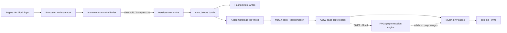

# FPGA-assisted MDBX page mutation for Reth persistence

Status: measurement-backed design proposal. This document defines an accelerator boundary and
validation plan; it does not implement an FPGA backend or change MDBX durability semantics.

## Summary

The proposed P0 block accelerates **StoragesTrie delete/upsert and the associated 4 KiB MDBX
copy-on-write (COW) page reconstruction**. P1 reuses the same page engine for AccountsTrie upserts.
MDBX remains the single transaction owner and retains B-tree traversal validation, page allocation,
free-list management, root/meta-page publication, commit ordering, sync, and crash recovery.

The initial FPGA must not write the database independently. It receives validated source pages,
an ordered mutation vector, and destination page numbers reserved by MDBX; it returns complete
replacement page images plus split/merge metadata. MDBX validates and installs those pages through
its normal dirty-page and commit path. Direct storage writes or write coalescing are a later,
separately gated phase.



## Evidence and scope

The retained experiment used Reth `v2.0.0` commit
`eb4c15e5e36d8776d46629beae4c0a69af7ab04f`, an accepted snapshot at block 25,661,083, an
immutable 500-block Ethereum mainnet corpus, 80 setup blocks, and a 20-block warm-up. The first 100
measured blocks were the deterministic discovery slice; the same candidate was then confirmed on
all 500 blocks. Xcode Instruments was unavailable and supplementary. Samply stacks and independent
Reth/MDBX Prometheus phase counters were the primary evidence.

The uninstrumented full-500 median was 3,779.539 s wall time. Persistence wait was 3,619.817 s,
`save_blocks` MDBX work was 3,355.957 s, sorted trie writes were 2,470.800 s, hashed-state writes
were 857.110 s, commit sync was 242.234 s, state-root calculation was 22.994 s, and execution was
89.404 s. A simultaneous Samply full run reproduced the same `pwrite`-ending persistence stack and
placed 85.79% of process thread CPU on the persistence thread.

A symbolized, operation-instrumented 100-block run refined the target:

| Evidence | Result |
|---|---:|
| Measured wall / persistence wait | 757.497 s / 703.944 s |
| Storage-trie write | 340.612 s |
| Account-trie write | 149.096 s |
| Trie `merge_batch` | 0.0173 s |
| StoragesTrie delete-current | 247,999 calls, 288.453 s |
| StoragesTrie upsert | 247,982 calls, 51.502 s |
| AccountsTrie upsert | 227,593 calls, 149.006 s |
| Dirty bytes summed at RW commits | 8,405,630,976 bytes |
| COW / new / split / merge / spill pages | 1,025,518 / 10,119 / 536 / 58 / 0 |
| Prefault write operations | 682,591, at least 2.604 GiB at 4 KiB/page |
| Node serialization | 0.1193 s |
| `_platform_memmove` | 76.287 CPU-s |

Operation histograms cover all calls carrying a given table/operation label and must not be blindly
summed with phase timers: seek labels also include trie-read/state-root call sites. The strongest
symbolized causal stack was
`StoragesTrie -> delete_current -> cursor_del -> page_touch_unmodifable -> page copy/GC allocation
-> pwrite`; a sibling path ended in `_platform_memmove`.

Standard Engine API runs with durable sync, persistence threshold 2, backpressure threshold 16,
and a zero memory-buffer target produced approximately 648.5 s of background `save_blocks` work
for the same 100 blocks at both 500 ms and 2 s input pacing. The input stream was throttled to about
0.153 blocks/s and spent 65–83% of samples at backlog 16. This proves production-path backpressure,
not only the benchmark-specific `wait_for_persistence=always` behavior.

These are Ethereum-mainnet input-rate surrogates, not native Optimism or Tempo benchmarks. Chain
block contents, pruning policy, storage layout, CPU, page size, and disk can change the service
rate. Every rollout gate therefore requires a chain-native production replay.

## Goals

1. Raise sustained persistence service rate so canonical buffering does not remain at its
   backpressure limit under the target chain's production arrival rate.
2. Accelerate the measured delete/upsert page-mutation primitive without changing database bytes,
   transaction visibility, durability, or recovery behavior.
3. Preserve a deterministic software fallback for unsupported page formats, dependency chains,
   capacity exhaustion, timeouts, and accelerator faults.
4. Attribute end-to-end gains to reduced page-mutation time using the same wall, phase, operation,
   page-counter, CPU/off-CPU, and I/O evidence used to select the target.

## Non-goals

- accelerating EVM execution, state-root calculation, trie-update merging, node serialization, or
  page split/spill as standalone blocks;
- changing Reth persistence thresholds to hide a service-rate deficit;
- allowing the FPGA to own MDBX transactions, publish meta pages, manage the free list, or issue an
  independent durable commit;
- claiming that every Reth-based chain has the same bottleneck magnitude;
- modifying vendored libMDBX before the interface and correctness oracle are proven in a separate
  integration change.

## Proposed boundary

### Work unit

A work unit is scoped to one MDBX write transaction and one database/table format generation:

```text
immutable source path pages
+ ordered delete/upsert operations
+ MDBX-reserved destination page numbers
+ page/layout/transaction metadata
-------------------------------------------------
= complete destination page images
+ dirty-page list
+ cursor result positions
+ split/merge propagation metadata
+ status and integrity digest
```

The host performs or validates the B-tree lookup before submission. Mutations are grouped by target
leaf and sorted in MDBX key order. The accelerator decodes slotted-page entries, applies deletes and
upserts, compacts/re-packs keys and values, copies unchanged regions, and emits a split proposal when
one page cannot hold the result. Parent propagation is either included in the submitted path bundle
or iterated by MDBX; the accelerator never invents a destination page number.

Delete-current requests carry the expected key and a digest of the observed value/page generation.
If the cursor moved or the page changed, MDBX rejects the completion and executes the operation in
software. This prevents a stale asynchronous completion from deleting a different record.

### Descriptor ABI

The first ABI should be fixed-width, little-endian, versioned, and usable over PCIe DMA rings. At a
minimum the submission descriptor contains:

| Field | Purpose |
|---|---|
| `abi_version`, `layout_id`, `page_size` | Reject unsupported MDBX layouts or page geometry |
| `txn_id`, `txn_generation`, `sequence` | Order work and reject stale completions |
| `dbi`, `root_pgno`, `source_path_count` | Identify the MDBX tree and validated path |
| source-page DMA address/length array | Immutable leaf-to-root input images |
| mutation-vector DMA address/count | Ordered seek/delete/upsert records and key/value bytes |
| reserved-page-number array | Destination identities allocated by MDBX |
| output DMA address/capacity | Space for page images and metadata |
| flags | DUPSORT, fixed-key/value, allow-split, checksum mode |
| `cookie` | Match completion without trusting queue position |

Each mutation record contains opcode, key/subkey/value offsets and lengths, expected page number and
generation, expected-current digest for delete, and stable ordering index. A completion contains
status, consumed operation count, output page count/bytes, dirty page numbers, split separators,
retired page numbers, cursor positions, and a digest covering every input and output byte.

### Scheduling

- Keep the existing single-writer transaction ordering. Multiple page work units may execute in
  parallel only when MDBX proves that their source paths and parent updates are independent.
- Coalesce consecutive operations for the same leaf so the page is copied and packed once.
- Submit account and storage tables on separate queues for observability, not weaker ordering.
- Apply completions strictly in transaction sequence. A later completion cannot become visible
  before all earlier dependent mutations are installed.
- Bound pinned/DMA memory and queue depth. Crossing either limit immediately uses software rather
  than blocking the persistence thread indefinitely.

## Correctness invariants

1. **Single ownership:** MDBX is the sole owner of the write transaction, allocation/free lists,
   roots, dirty-page bookkeeping, meta pages, and commit/sync.
2. **Byte equivalence:** given identical source pages, operations, and allocated page numbers, the
   hardware output must be byte-for-byte equal to the software mutation output, including unused
   space normalization required by the selected layout.
3. **Snapshot isolation:** FPGA work is private to the active write transaction until MDBX's normal
   commit publication; readers cannot observe partial output.
4. **No late writes:** after timeout, cancellation, abort, or generation change, DMA permissions are
   revoked before MDBX reuses buffers or page numbers. Late completions are ignored.
5. **Atomic fallback:** any unsupported format, invalid digest, capacity error, split overflow,
   timeout, PCIe reset, or verification failure discards the entire affected work unit and reruns it
   in software from the last valid transaction state.
6. **Durability unchanged:** FPGA completion is not durability. Only MDBX's existing commit and sync
   result may acknowledge persisted state.
7. **Recovery unchanged:** a crash at every boundary recovers to either the previous or new MDBX
   transaction using the existing meta-page protocol, never an FPGA-specific state.

## Implementation phases

### P0: storage delete/upsert page engine

Build a software reference implementation behind a page-mutation trait, then an optional DMA
backend. Target StoragesTrie delete-current and upsert, including page copy/compaction and split
metadata. Keep all filesystem writes in MDBX. This phase tests whether page reconstruction—not the
kernel write itself—has enough removable time.

### P1: account upsert and larger batches

Add AccountsTrie upsert and batch multiple independent leaf mutations per descriptor. Re-evaluate
the persistence threshold only after service time improves; batching is a workload/control-plane
parameter, not a substitute for the measured fix.

### P2: write coalescing or storage-attached deployment

Consider coalesced page installation, `pwritev`, or a storage-attached FPGA/NVMe path only if P0/P1
leave kernel write preparation as the largest measured residual. This phase requires a new threat
model and crash-consistency proof because it crosses the current MDBX/file-system ownership
boundary.

## Telemetry

All hardware and software paths expose the same labels and transaction identifiers. Required new
metrics are:

- submitted/completed/fallback/timeout/verification-failure work units and operations;
- queue, DMA-in, compute, DMA-out, validation, install, commit-write, and commit-sync duration;
- input/output bytes, page images, COW pages, splits, merges, and batch occupancy;
- exact host `pwrite`/`pwritev` call and byte totals when an integration point can obtain them;
- hardware-active versus software-fallback `save_blocks` account/storage phase durations;
- persistence backlog, backpressure duration, batch size, accepted block rate, and endpoint latency.

The current public MDBX page counters expose prefault/write call counts but not exact vector byte
lengths. The measured 2.604 GiB is therefore a strict one-page-per-prefault lower bound, not exact
process write traffic. Exact call/byte telemetry is a P0 integration requirement, not a fabricated
benchmark result.

## Verification plan

1. **Golden page tests:** capture legal MDBX page/path fixtures and compare software and accelerator
   outputs byte-for-byte for single and batched seek/delete/upsert cases.
2. **Property and differential tests:** generate ordered DUPSORT operations, variable fill levels,
   prefix keys, overflow values, splits/merges, duplicates, and page-number reuse; run both engines
   and compare pages, cursor results, roots, and free-list effects.
3. **Fault injection:** timeout or reset the accelerator before DMA, mid-DMA, after completion, while
   installing pages, before commit, during commit write, and during sync. Cold reopen must match the
   software oracle at every point.
4. **Frozen replay:** run the existing 20+100 discovery and full 500-block confirmation from fresh
   APFS clones. Verify endpoint block hash/state root, persisted head, table checksums, and cold
   reopen.
5. **Production-path replay:** run standard Engine API input at and above target arrival rate with
   durable sync. Report injection/drain separately and compare backlog/backpressure distributions.
6. **Chain-native replay:** repeat with the intended Optimism, Tempo, or other production chain's
   real block distribution and configuration before making a deployment claim.

## Performance gates and ceiling

The accelerator is accepted only if all correctness gates pass and the median of at least three
fresh trials shows:

- lower storage/account trie write wall time with no regression in hashed-state, commit, or
  execution phases;
- lower persistence backlog/backpressure at the target arrival rate;
- no material p95/p99 regression from DMA batching or fallback;
- an end-to-end gain larger than profiling variance and accelerator overhead;
- bounded CPU, pinned memory, PCIe traffic, and queue depth.

Amdahl ceilings set expectations. On the detailed 100-block run, ideal removal of storage-trie
write time would cap speedup at about 1.82x; ideal removal of both storage and account trie write
time would cap it at about 2.82x. On the uninstrumented full-500 median, ideal removal of all sorted
trie-write time caps speedup near 2.89x. If that phase were accelerated by 10x with zero overhead,
the full-workload ceiling would be about 2.43x. Real gains will be lower because seek validation,
DMA, page installation, hashed-state writes, commit/sync, and residual kernel I/O remain.

## Rollout

Ship the interface disabled by default. Enable shadow mode first: execute hardware and software,
compare results, and install only software pages. Next allow verified hardware output with automatic
per-work-unit fallback and a kill switch. Production enablement requires sustained zero mismatches,
successful crash testing, chain-native service-rate gains, and an operational procedure that can
disable the accelerator without database migration or downtime.
