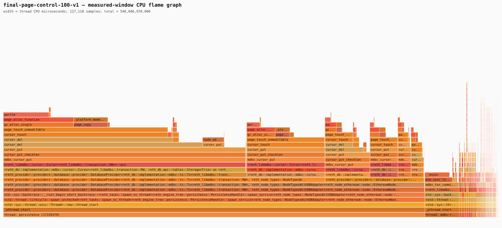
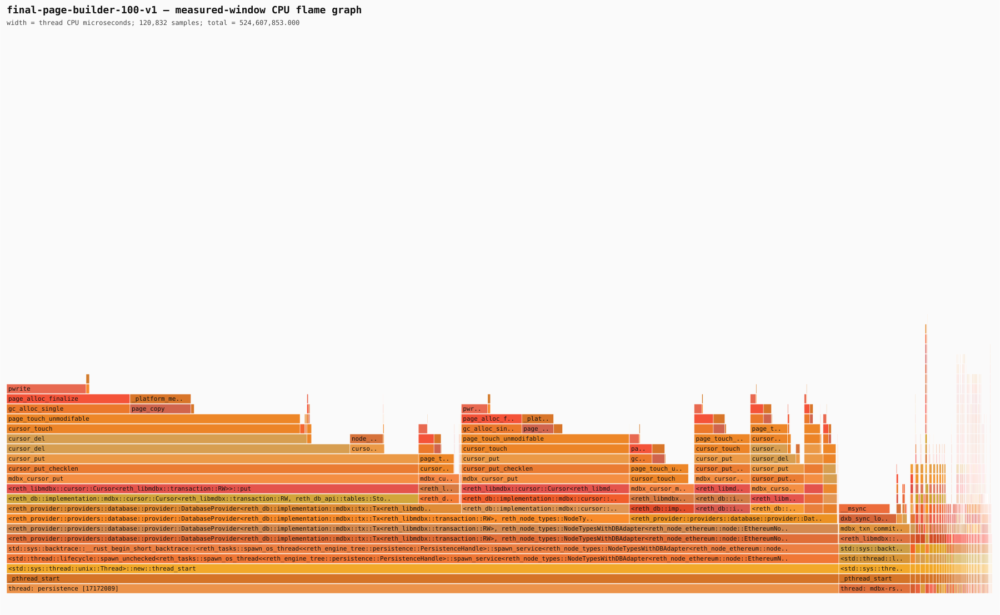
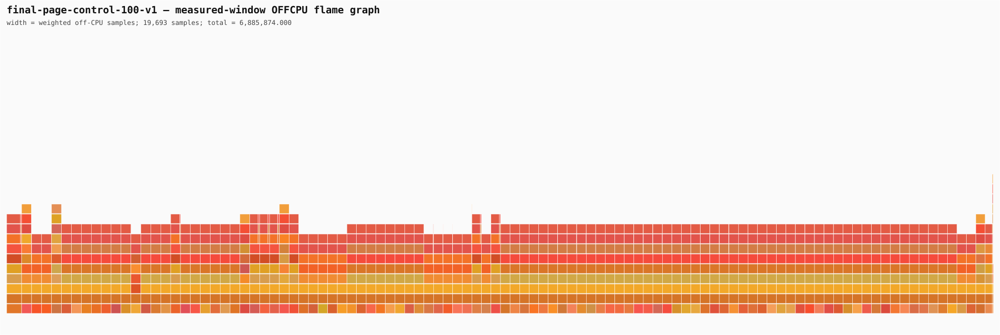
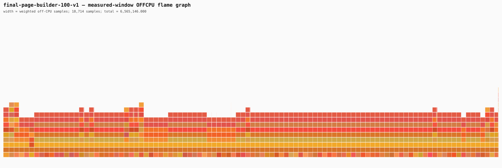

# MDBX final-page builder benchmark

## Outcome

The broader MDBX final-page builder is functionally correct and reduced the frozen 100-block
injection wall clock by 4.13%, but it did **not** reduce unique transaction COW pages. COW rose by
579 pages (+0.059%), dirty-page equivalents rose by 1,190 (+0.060%), and page splits rose by 17
(+3.21%). It is therefore a useful CPU-path experiment, not the accepted COW-reduction candidate.
The full 500-block confirmation was intentionally not run.

The accepted software method for reducing COW remains the larger 33-block persistence transaction
documented in [the transaction-batching report](./cow-transaction-batching-benchmark-report.md).
That candidate reduced COW pages per persisted block by 19.81% on discovery and retained the gain
on the full 500-block workload. The distinction is causal: a leaf final-page builder removes some
repeated row manipulation inside one transaction, while a larger transaction lets MDBX reuse an
already-dirtied leaf across mutations from multiple blocks.

## Implemented boundary

This experiment replaces the earlier same-size-replacement prototype with a complete ordered
mutation stream:

- libMDBX C API: `mdbx_cursor_mutate_batch`
- mutation types: delete, upsert, and variable-size replace
- low-level Rust wrapper: `reth_libmdbx::Cursor<RW>::mutate_batch`
- typed Reth API: `DbDupCursorRW::mutate_duplicates_batch`
- Reth integrations: hashed-storage and storage-trie persistence
- runtime A/B switch: `RETH_MDBX_FINAL_PAGE_BATCH=0|1`
- Prometheus evidence: attempts, applied batches, mutations, source/destination pages and bytes,
  fallback reasons, transaction page operations, and persistence-phase page operations

The C path first validates and builds every destination leaf in scratch storage. It then touches
the outer path and each destination leaf path once, copies the packed image into the dirty page,
repairs first-key separators, and publishes the nested-tree descriptor. Unsupported or unsafe
layouts return before touching the transaction and Reth replays the original sequential cursor
operations. A peer cursor positioned on the same outer DUPSORT record also forces an atomic
fallback to avoid stale cursor indices.

The implementation was exercised by mixed delete/upsert/variable-size replacement tests, a page
overflow atomic-fallback test, a peer-cursor fallback test, repeated mutations inside one write
transaction, typed DUPSORT integration, trie database tests, provider trie-update tests, and
stopped-node cold reopen of the frozen mainnet slice.

## Matched experiment

The control and candidate used the same symbolized optimized Reth binary. The control disabled the
C fast path while still constructing the same typed mutation vectors; the candidate enabled it.
Each run cloned the same frozen database independently, executed 80 excluded setup blocks and 20
excluded warm-up blocks, then measured blocks 25,661,184 through 25,661,283 with durable sync and
three-block persistence batches. Both runs used Samply at 99 Hz and passed cold-reopen block-hash
and state-root equality at block 25,661,283.

- source HEAD: `fb37bce8741a19cc17145328b98d64dc413a8c4b`
- measured source diff SHA-256: `973646fdbd58b492770000cf7335f3f8183d746515a0d7ce92cfc2df8c4fd294`
- Reth binary SHA-256: `ec5f4ccde2304f47d9bf44e3f60955b1e59141138793d02070677279db19af3f`
- retained `reth-bench` SHA-256: `43fbab6fc50e1b04dca83ddaa5723569788b6822fff3c551a9c6f3b4c5f90768`
- frozen corpus SHA-256: `5dc0e9cbc1f215b30866d2d11b320d33dfe4b3cc9c5db848b826366f83aeed5f`

The profiler recorded the correct source HEAD inside the frozen-input guard. The runner was also
fixed after this experiment so its legacy top-level `source_commit` field no longer reports an old
pinned constant.

## Wall-clock, CPU, and page evidence

| Metric | Fast path off | Final-page builder | Change |
| --- | ---: | ---: | ---: |
| 100-block injection | 698.593 s | 669.759 s | -4.13% |
| excluded durability drain | 25.535 s | 24.477 s | -4.14% |
| injection plus drain | 724.128 s | 694.236 s | -4.13% |
| injection CPU | 525.67 core-s | 504.35 core-s | -4.06% |
| average process cores | 0.752 | 0.753 | +0.07% |
| persistence-wait ratio | 93.52% | 93.61% | +0.09 points |
| MDBX COW pages | 986,549 | 987,128 | +579 (+0.059%) |
| dirty-page equivalents | 1,974,208 | 1,975,398 | +1,190 (+0.060%) |
| newly allocated pages | 9,621 | 10,563 | +942 (+9.79%) |
| page splits | 529 | 546 | +17 (+3.21%) |
| prefault write operations | 409,971 | 399,549 | -10,422 (-2.54%) |
| minimum prefault bytes at 4 KiB/op | 1.679 GB | 1.637 GB | -2.54% |
| device bytes, system-wide estimate | 76.003 GB | 73.375 GB | -3.46% |

The 4.13% wall improvement is supported by 4.06% less process CPU and fewer prefault write calls,
but it is not COW reduction. MDBX already copies a unique page at most once in a write transaction;
repacking the same dirty leaf more efficiently cannot eliminate the first mandatory copy of every
leaf touched by that transaction.

### Persistence-phase attribution

| Phase | Fast path off | Final-page builder | Change |
| --- | ---: | ---: | ---: |
| storage-trie write | 341.334 s | 310.904 s | -8.91% |
| account-trie write | 113.410 s | 117.693 s | +3.78% |
| combined trie merge/write | 454.759 s | 428.612 s | -5.75% |
| storage-trie COW pages | 450,755 | 451,328 | +573 |
| hashed-state COW pages | 282,482 | 282,491 | +9 |
| account-trie COW pages | 251,972 | 251,972 | unchanged |

The builder improved storage-trie CPU time while leaving its unique COW set intact. The small COW
increase is concentrated in storage trie and is accompanied by extra new/split pages, so it cannot
be presented as a physical page-work reduction.

## Coverage and fallback evidence

| Table | Attempts | Applied | Applied rate | Mutations | Source pages | Destination pages |
| --- | ---: | ---: | ---: | ---: | ---: | ---: |
| HashedStorages | 9,642 | 7,374 | 76.48% | 36,398 | 33,789 | 33,789 |
| StoragesTrie | 8,207 | 4,827 | 58.82% | 30,450 | 22,539 | 22,539 |

Hashed-storage fallbacks were subpage 1,188, multiple-leaves 707, not-found 300, page-full 70, and
empty-page 3. Storage-trie fallbacks were multiple-leaves 2,491, subpage 725, not-found 144,
page-full 19, and empty-page 1. The relatively high applied rates rule out “the fast path never
ran” as an explanation for the negative COW result. Within successful batches the source and
destination page counts are exactly equal, directly showing that the builder rewrote the required
leaf set rather than reducing it.

## Stack evidence and flame graphs

The candidate reduced legacy leaf manipulation: CPU leaves for `cursor_del`, `cursor_put`, and
`node_add_leaf` fell from 31.967, 28.202, and 27.493 CPU-s to 23.737, 21.318, and 19.963 CPU-s.
The new `mdbx_cursor_mutate_batch` leaf consumed 5.423 CPU-s. Absolute `_platform_memmove` CPU fell
only 0.59%, from 83.681 to 83.187 CPU-s. `page_touch_unmodifable` remained the largest leaf and rose
from 137.521 to 139.483 CPU-s; `pwrite` fell from 84.355 to 77.945 CPU-s.

The off-CPU graphs remain dominated by condition-variable waits. The control recorded 146,803
measured Samply rows and the candidate 139,546; the rendered CPU graphs contain 127,110 and 120,832
samples respectively.

### Control, CPU

### Candidate, CPU

### Control, off-CPU

### Candidate, off-CPU

## Decision

Reject this implementation as the COW-focused candidate and do not spend a full 500-block run on
it. Retain it as a CPU reference showing that batched final-leaf construction can remove some
cursor work, but not the mandatory first COW of every distinct leaf.

For software COW reduction, use a bounded multi-block write transaction. The already measured
33-block setting reduced COW per persisted block by 19.81% and injection wall time by 20.78% versus
batch 17, and its full 500-block run held COW at 5,026 pages per persisted block. The next
production-oriented implementation should make that batching adaptive and bound it by elapsed
time, dirty bytes, and block count so throughput gains do not imply unbounded commit latency or
crash-replay distance.

Only after that software reduction should FPGA work target the remaining `page_touch_unmodifable`,
packing/offset repair, and write-descriptor path. This experiment does not justify an FPGA that
only replaces `cursor_del`/`cursor_put` calls.
